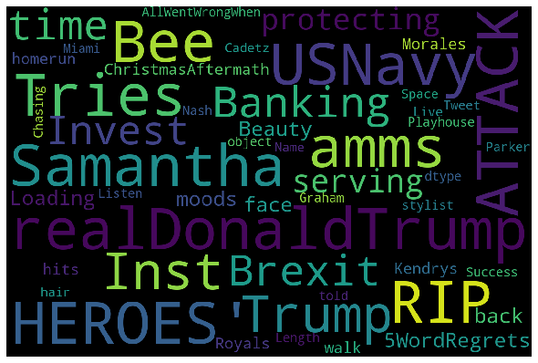
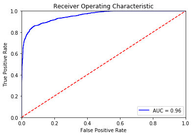
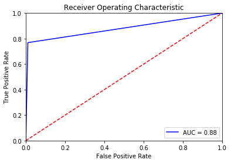

# Twitter-spam-classification


## 1) problem statement

- Classify tweet into spam/non-spam ( current focus on covid19 related tweet)
- As there is no label data yet, we will use other twitter spam dataset to determine its accuracy and perhaps can create human-- in-the-loop system to constant update and feedback the system

- data source for model training
https://www.kaggle.com/c/utkmls-twitter-spam-detection-competition/data


## 2) text preprocessing
```
def clean( raw_text ):
    letters_only = re.sub("[^a-zA-Z]", " ", str(raw_text)) # Remove non-letters
    words = letters_only.lower().split()  # Convert to lower case, split into individual words                           
    stops = set(stopwords.words("english"))   # In Python, searching a set is much faster than searching a list, so convert the stop words to a set             
    meaningful_words = [w for w in words if not w in stops]   # Remove stop words
    #meaningful_words = [stemmer.stem(x) for x in meaningful_words ]  #stemmiing malay words
    return ( " ".join( meaningful_words )) # Join the words back into one string separated by space, and return the result.

```


## 3) Word cloud visualization

#### Kaggle tweet data set (Spam)


##### Kaggle tweet data set (non-Spam)


----- 

-----
## 4) model 

### Naive bayes classifier
```
## build a data processing pipeline
text_clf = Pipeline([('vect', CountVectorizer(max_features = 5000, ngram_range=(1, 2))),
                     ('tfidf', TfidfTransformer()),
                     ('clf', MultinomialNB(alpha=0.01)),])
```

#### AUC score = 0.96



### SVM classifier
```
text_clf_svm = Pipeline([('vect', CountVectorizer(max_features = 5000, ngram_range=(1, 2))),
                         ('tfidf', TfidfTransformer()),
                         ('clf-svm', SGDClassifier(loss='hinge', penalty='l2',alpha=0.001, random_state=42)),])
```
#### AUC score ~0.88


-----


## 5) Classify on new dataset ( covid19 only dataset)

#### result file

https://docs.google.com/spreadsheets/d/1TWSyk1fx5easzWWcUkC6bxIDbeyOfOCoA6gwpE4r9IM/edit?usp=sharing

#### Covid19 tweet data set (Spam)


##### Covid19 data set (non-Spam)


-----


### Summary and suggestion
- the word distribution quite different in  <font color='red'> kaggle-tweet-training data </font> vs <font color = 'blue'> covid19 tweets data </font> , thus we might need add in new covid19 related labeled data to ensure it able to capture more contextual data
- human evaluation and feedback needed to update the predicted-label
- explore unsupervised method like keyword clustering, semantic similarity between spam and other
- we can add in emotional features to help further analysis on the spam and non-spam tweets
