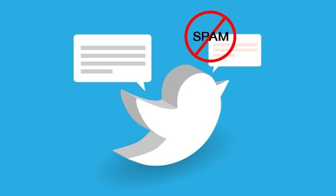
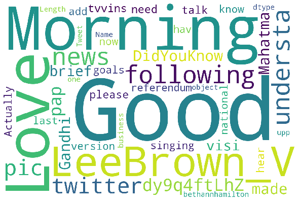
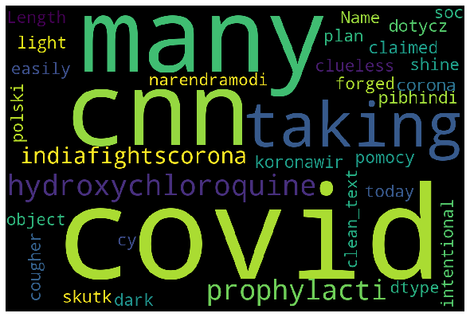
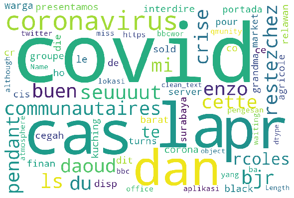

# Twitter-spam-classification

## problem statement

- Classify tweet into spam/non-spam ( current focus on covid19 related tweet)
- As there is no label data yet, we will use other twitter spam dataset to determine its accuracy and perhaps can create human-- in-the-loop system to constant update and feedback the system

## data source for model training

https://www.kaggle.com/c/utkmls-twitter-spam-detection-competition/data

## summary finding 

tweet spam detection can divided into 2 area

- (1) Account level (detect bot, spam account)
- (2) classify spam text only

current work focus on item(2)

- the word distribution quite different in   kaggle-tweet-training data  vs  covid19 tweets data  , thus we might need add in new covid19 related labeled data to ensure it able to capture more contextual data

Kaggle tweet data set (Spam)

Kaggle tweet data set (non-Spam)

//////////

Covid19 tweet data set (Spam)

Covid19 data set (non-Spam)

Suggestion:
- human evaluation and feedback needed to update the predicted-label
- explore unsupervised method like keyword clustering, semantic similarity between spam and other
- we can add in emotional features to help further analysis on the spam and non-spam tweets
